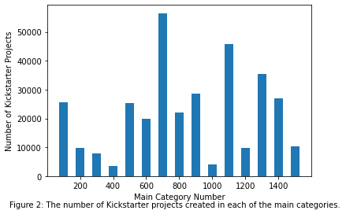
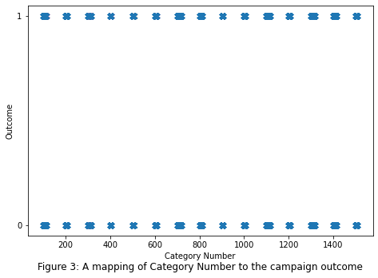
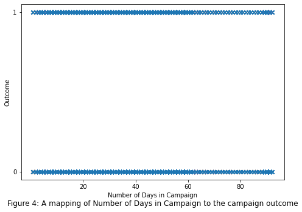
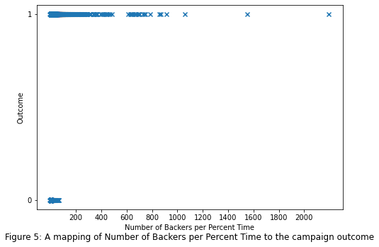
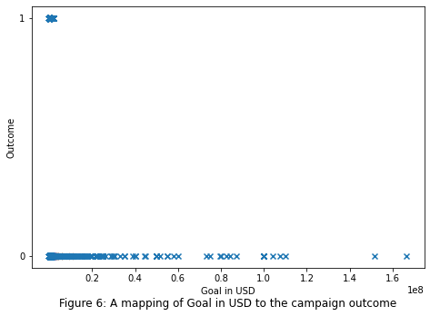
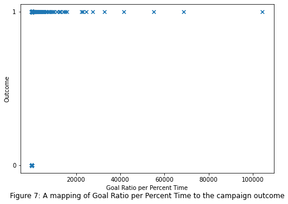
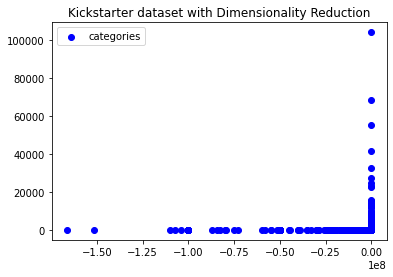

# Kickstarter Success Prediction
## Team 45: Joshua Ng, Kayla Hunt, Minjae Lee, Youngho Lim, Karishma Rana

## Project Proposal video:
[Youtube video](https://youtu.be/4cCjK_wPxOY)

### Introduction:
Since its inception in 2009, Kickstarter has been a popular way for entrepreneurs and creators to raise funds for their project. Anyone can become a backer for a project, pledging any amount of money and only paying if the project is deemed successful. Success on Kickstarter is defined as reaching the goal pledge amount within a predetermined time frame, at which point funds are collected and given to the creators. If the goal amount is not reached, the project is considered a failure. The current success rate of projects is relatively low, with only 44 percent of Kickstarter projects being considered successful (Yuan et al.). The most important information provided by our dataset is the category of the project, fundraising goal, how long the campaign was open, number of backers, amount pledged, country pledged from, and the outcome of the project.

### Problem Definition:
#### What is our motivation behind this project?
The goal of our project is to predict the future success of a project put on Kickstarter. The motivation for this project is the number of projects that creators try to fund, with low levels of success. If we can accurately predict the success or failure of a project given how well they crowdfund (amount of backers, amount pledged, etc.), we can help creators to decide to pursue the project before the time, effort, and money is expended to create the campaign.

### Our Dataset:
[Kickstarter Projects](https://www.kaggle.com/kemical/kickstarter-projects?select=ks-projects-201801.csv)
#### Data Features:
- Kickstarter ID
- Kickstarter name
- Category
- Main_category
- Currency
- Deadline
- Goal
- Pledged
- State

### Data Collection:
Our dataset was sourced from Kaggle and contains data on Kickstarter projects from 2009-2018. The data contained information about the project's timeline, it's goal amount, how much was raised and the category of the project. We chose this dataset becuase of its size with over 331 thousand completed projects. It also represents a wide range of project dates, which encapsulates changes in the popularity of Kickstarter (as the platform gained publicity since its 2009 creation). The classification labels of this dataset are clearly defined and binary, which makes defining success to the models clearer. 
To trim this data, we deleted any projects that were still ongoing as we did not have the data about the projects completion. We also consolidated the data to be generalized in USD rather than any other currencies. 

Due to the nature of the categories needing to be quantified, each category was given a numerical value in order to be able to be processed by our models. This translation allowed us to visualize our data and see the graphical trends between the type of category and success rate, as well as be able to use the categories as a feature in our models. 

There were 15 main categories, with a variable number of subcategories. These were Arts, Comics, Crafts, Dance, Design, Fashion, Film & Video, Food, Games, Journalism, Music, Photography, Publishing, Technology, and Theater. They are number encoded from  0100 to 1500, where main categories represent the first two digits and subcategories represent the second two digits. Subcategories are labels like action, animation, and comedy for Film & Video and ceramics, digital art, and painting for Arts. Overall there are 157 possible category classifications for a project given by the dataset. 

### Dataset visualization
Pictured below are the distribution of our various categories. 

There are 31 columns total, 12 string features, 8 decimal features, 4 date/time features, and 7 other.

### Methods 
Currently, the algorithms that we have contemplated using to solve this problem are some combination of Naive Bayes, Logistic Regression, and Random Forests. All three of these potential algorithms are designed for supervised learning and classification problems, the type of problem that our dataset falls under. Additionally, we can utilize NLP algorithms like Neural Bag of Words on certain features such as project titles and categories to further help predict the projects’ chances of success.  Of course, the chosen algorithms are subject to change in the future, especially since the lectures have yet to cover supervised learning.

### Predicted Results
Ideally, the result would be that the models we create would correctly label the data more than half of the time. That being said, based on the third-party research we conducted we found that previously created models averaged around a 65% to 75% accuracy (Chen et al.) (Greenburg et al.) (Yuan et al.). While it is worth noting that these models utilized different features than the ones our chosen dataset affords us, we still anticipate that creating a model with a similar accuracy will come with its challenges.

### Feature Reduction (PCA)
Upon analyzing our data, there were some category numbers that did not have an intrinsic relationship with the success of the Kickstarter. To first approach our data, we first applied principal componenet analysis (PCA) to reduce our dataset. We reduced the dataset to 3 features from a total of 31 features and retained a 94% variance. Our new labelled categories and features can be foudn in the legend.txt file. 

The different groups of datapoints on the scatterplot represent the different grouping of similar features. There is difficulty distinguishing between different category numbers as well as USD for each goal, so there is not a clear trend for our reduced data. 

## Naive Bayes
After reducing our data dimensions and training the model, we end up with an accuracy of 59.2%. This less than ideal accuracy is a result of the shortcomings of PCA. Typicaly , PCA does not accept categorical data. We had to take out the categorical data, run PCA, and add the catogrical data back to our reduced dimensions, which could explain the reduction in accuracy. PCA also has difficulty determining order if variables are not correlated. I believe that there is not a strong correlation between our data for USD raised and category, so PCA was unable to determine a correlation. Because this was the case, PCA ordered our variables according to variances, which heavily affected our accuracy.

## Natural Language Processing
In addition to Naive Bayes, we implemented the NLP Bag of Words approach on our list of Kickstarter titles and categories. 
Initially training the model with 20% of the dataset, we get a result of 64% accuracy and an F-score of 0.6. However, when we increase the size of the dataset we are sampling, as well as use better hardware, our accuracy increases.
I tested with 30% of the dataset, and as seen below, we yield a greater F-1 test and accuracy.

The final approach we used was long term short memory. The difference between bag of words and LSTM is that there are feedback connections present. After running 30 epochs, our results are shown below. 

The drop in accuracy can be explained by the nature of our data: the categories make it difficult to differeniate data and approach it with either bag of words or LSTM.

## Random Forest
Out of all the algorithms we had used, random forest was the algorithm with the highest success rate and accuracy, as well as the most efficient. While all our other algorithms took around 3 hours to run 30 epochs even with CUDA enabled, random forest was the quickest and most efficient, clocking in at only 2 minutes. 
With our data already processed with PCA, there was no need to worry about accuracy drops due to overfitting. Because of the random nature of our algorithm, selecting the feature to split the decision tree is very simple and is not dependent on our subset of data. This leads to increased accuracy and less time processing the most important feature to split on. 

This is forest of our data, and the different random leaves we split the trees on. The structure of this tree is dynamic, and always consistently gives us 90% accuracy.

We also utilized MDI, which is mean decrease in impurity. This is a measure of the disorder of our subset of data. We calculate the total reduction in loss or impurity when splitting on a given feature, and also contributes to the efficiency of our algorithm. Also known as the 'gini important', calculating MDI is useful for calculating the probability of misclassifying an observation, which can affect our accuracy. 

The lower the MDI, the better the split, which reduces the likelihood of misclassification.

### References
- Yuan, Hui, et al. “The Determinants of Crowdfunding Success: A Semantic Text Analytics Approach.” Decision Support Systems, North-Holland, 6 Aug. 2016, https://www.sciencedirect.com/science/article/pii/S0167923616301373. 
- Chen, Kevin, et al. “Courses.cms.caltech.edu.” KickPredict: Predicting Kickstarter Success, http://courses.cms.caltech.edu/cs145/2013/blue.pdf. 
- Greenberg, Michael D, et al. “Crowdfunding Support Tools: Chi '13 Extended Abstracts on Human Factors in Computing Systems.” Crowdfunding Support Tools: Predicting Success &amp; Failure, 1 Apr. 2013, https://dl.acm.org/doi/pdf/10.1145/2468356.2468682. 

