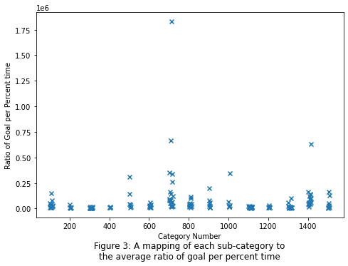
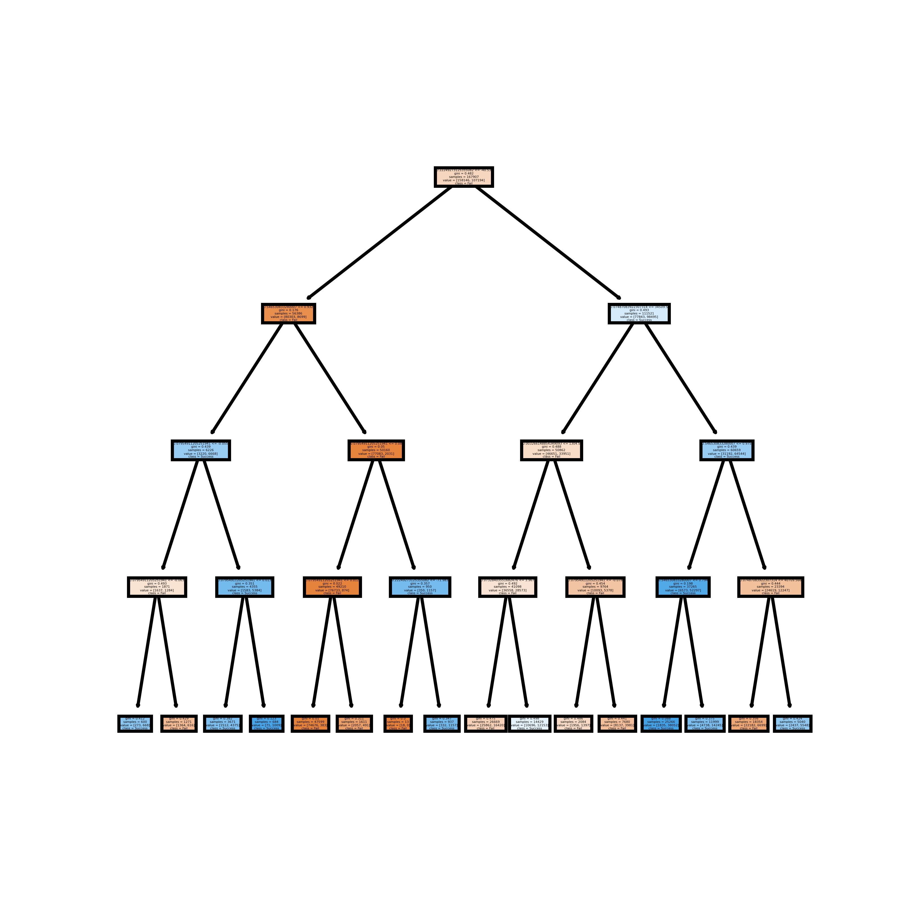

# Kickstarter Success Prediction
## Team 45: Joshua Ng, Kayla Hunt, Minjae Lee, Youngho Lim, Karishma Rana

## Project Proposal video:
[Youtube video](https://youtu.be/4cCjK_wPxOY)

## Final Project Video:
[Youtube video](https://www.youtube.com/watch?v=h4jkAYJMAWY)

### Introduction:
Since its inception in 2009, Kickstarter has been a popular way for entrepreneurs and creators to raise funds for their project. Anyone can become a backer for a project, pledging any amount of money and only paying if the project is deemed successful. Success on Kickstarter is defined as reaching the goal pledge amount within a predetermined time frame, at which point funds are collected and given to the creators. If the goal amount is not reached, the project is considered a failure. The current success rate of projects is relatively low, with only 44 percent of Kickstarter projects being considered successful (Yuan et al.). The most important information provided by our dataset is the category of the project, fundraising goal, how long the campaign was open, number of backers, amount pledged, country pledged from, and the outcome of the project.

### Problem Definition:
#### What is our motivation behind this project?
The goal of our project is to predict the future success of a project put on Kickstarter. The motivation for this project is the number of projects that creators try to fund, with low levels of success. If we can accurately predict the success or failure of a project given how well they crowdfund (amount of backers, amount pledged, etc.), we can help creators to decide to pursue the project before the time, effort, and money is expended to create the campaign.

#### Our Dataset:
[Kickstarter Projects](https://www.kaggle.com/kemical/kickstarter-projects?select=ks-projects-201801.csv)
##### Data Features:
- Kickstarter ID
- Kickstarter name
- Category
- Main_category
- Currency
- Deadline
- Goal
- Pledged
- State

### Data Collection:
Our dataset was sourced from Kaggle and contains data on Kickstarter projects from 2009-2018. The data contained information about the project's timeline, it's goal amount, how much was raised and the category of the project. We chose this dataset becuase of its size with over 331 thousand completed projects. It also represents a wide range of project dates, which encapsulates changes in the popularity of Kickstarter (as the platform gained publicity since its 2009 creation). Additionally, the classification labels of this dataset are clearly defined and binary, which makes defining success to the models clearer. To trim this data, we deleted any projects that were still ongoing as we did not have the data about the projects completion. We also consolidated the data to be generalized in USD rather than any other currencies. 

Due to the nature of the categories needing to be quantified, each category was given a numerical value in order to be able to be processed by our models. This translation allowed us to visualize our data and see the graphical trends between the type of category and success rate, as well as be able to use the categories as a feature in our models. 

There were 15 main categories, with a variable number of subcategories. These were Arts, Comics, Crafts, Dance, Design, Fashion, Film & Video, Food, Games, Journalism, Music, Photography, Publishing, Technology, and Theater. They are number encoded from  0100 to 1500, where main categories represent the first two digits and subcategories represent the second two digits. Subcategories are labels like action, animation, and comedy for Film & Video and ceramics, digital art, and painting for Arts. Overall there are 157 (172 if no subcategories are included) possible category classifications for a project given by the dataset. The translation from one to another can be seen below:

Moreover, since we wanted the features (and thus the model) to be generalizable to any currently running campaigns, we decided to generate some generalizable features from those provided and train off of those instead. (That being said, we did ensure to incorporate all of the relevant information from the provided features in the generated set.) For example, the original data provided us with the start and end date of each campaign. However, a specific start and end date is not generalizable and thus, we used that information to find the duration of the campaign in days, something that can be applied to other currently running campaigns.

The original data set has 15 columns total, 5 string features, 7 decimal features, 2 date/time features, and 1 label colum. The dataset with generalizable features has 8 columns total, 7 decimal features and 1 label column.

#### Dataset visualization
Pictured below are two different distributions of our various features. 

Each subplot of Figure 1 shows the average value of the outcome between 0 and 1 of each value of the given feature. Note, however, that for features with continuous values (so the third graph onwards), the values are rounded and grouped together to simplify the visual.

Similar to Figure 1, each subplot of Figure 2 shows the number of projects that each value of the given feature can be found in. Again,note that for features with continuous values, the values are rounded and grouped together to simplify the visual.

Pictured below is the distribution of one of our features, the Categories

In Figure 3, Categories are mapped against the ratio of Total Raised in USD to the Goal in USD, which is an indicator of the success of a project. As evident, category 700 (Film & Video) has high ratio values, imply a high rate of success within that category. That would make sense as the category subplot of Figure 2 implies a high popularity for that category, and thus a relatively high success rate.

### Methods 
The two main methods we used were Naive Bayes and Random Forests. We chose these algorithms as are designed for supervised learning and classification problems, the type of problem that our dataset falls under since the provided labels are binary. In addition to these two methods, we also used NLP algorithms like Neural Bag of Words. While using NLP algorithms is arguably out of scope for this project, we wanted to determine if certain string features such as project titles and categories could help further predict a given project's chances of success.

#### Benchmark Results
Based on the third-party research we conducted we found that previously created models that predicted Kickstarter campaign successes averaged around a 65% to 75% accuracy (Chen et al.) (Greenburg et al.) (Yuan et al.). While it is worth noting that these models utilized different features than the ones our chosen dataset affords us, we decided to mark the 65% to 75% range as our benchmark goal for the three models we were going to use. However if we could not reach this benchmark goal, at the very least, we wanted our models to predict than a 50-50 coin toss, since the classes were binary.

#### Feature Reduction (PCA)
Upon skimming through the spreadsheet and analyzing the data, we found that there were some features that seemed to have a clearer relationship with the success of the Kickstarter campaign than other features. Thus, we wanted to reduce our dataset to pick out the best features. To that end, we applied principal componenet analysis (PCA) to reduce our dataset. This way, we reduced the dataset from 5 continuous features down to 3 continuous features.

It is worth noting that typicaly , PCA does not accept categorical data. As such, when running PCA, we had to take out the categorical data, run PCA on the remaining continuous data, and then add the catogrical data back to our reduced dimensions. With this in mind, when we ran PCA on our dataset, we reduced it from 7 features down to 5 features.

### Results and Discussion
#### Naive Bayes
For our Naive Bayes model, we implemented our own. And since our data consisted of categorical and continuous data, implementing our own model meant finding the probabilities of these features on our own, with each type of data's probablility calculated differently.For the categorical data, we simply counted the instance of each category over all instances over all categories to find their probabilities.
For the continuous data, we assumed a normal distribution for the features, and sampled that distribution for the probabilities.

After reducing our data dimensions with PCA, we trained our model using the probabilities found through the method outlined above. After testing our model, we acheived a 69% accuracy, with a precision of 57%, a recall score of 88%, and an F1 score of 69%.

There is, perhaps obviously, room for improvement for this model. The most major way that we can improve this model is by changing the chosen distributions that represent each continuous feature. Currently, we assume that each of the continuous features takes on a normal (Guassian) distribution. However, as seen below (and on the graphs from Figure 2), we can see that this is not the case for most of the continuous features. The image on the left shows data that could arguably be modeled by a normal distribution, but the image on the right shows data that can definitely not be modeled as such. If we choose a more fitting distribution for these features, such as a lognormal distribution, the accuracy of this model would increase.

 

Similarly, another possible reason that this model has a lower accuracy is due to another assumption, the Naive assumption. With the Naive assumption, we assume that all the features are independent of one another. However, it is very possible that the features are not completely independent, thus affecting the accuracy of the model.

#### Random Forest
For our Random Forest model, we imported Scikit Learn's RandomForestClassifier and DecisionTreeClassifier. We chose this model because of its efficiency and accuracy. Moreover, this algorithm finds a better model because it split the tree based on randomness, rather than the most important feature in the subset. After running our data through PCA, we trained our model with the feature reduced dataset. Below is an image of one of the decision tress in the generated RandomForestClassifier.

After training our model, we tested it and found that we consistently got a 90% accuracy rate. Moreover, this model had a precision of 84%, a recall score of 91% and an F1 score of 88%.

This high accuracy is in part due to the use of the Mean Decrease in Impurity (MDI) value when deciding where to split. The MDI value is a measure of the disorder within a subset of data. When splitting based on the MDI value, the total reduction in impurity is calculated and the greater that reduction is, the better the split is. And in turn, the better the split is, the better the accuracy becomes. Below is an image showing the feature importances through MDI.

All that being said, this model's accuracy can also be improved. Currently, we set each of the decision trees to only go to a max depth of 4. But, we may also allow the DecisionTreeClassifier to run without setting a max depth, in which case the trees that it would generate would keep going until its leaf nodes have a minimum number of nodes or are pure. Letting the model run completely yields an accuracy of 99%, a precision of 98%, a recall of 99.7%, and a F1 score of 99%. However, although it does not take much longer for the model to completely run like this on our dataset, in a general sense, letting it run completely takes a lot of resources and is unrealistic for much larger dataset. As such, we have decided to forgo the higher accuracy in favor of the less resource intensive model with the max depth, even though it has a lower accuracy.

#### Natural Language Processing
As aforementioned, in addition to our Naive Bayes and Random Forest models, we implemented a couple NLP algorithms.

##### NBoW
The first of the NLP algorithms was the Neural Bag of Words approach, initially used on only the Kickstarter titles. By initially training the model with only 20% of the dataset, we got an accuracy of 64% and an F1 score of 60%. However, when we increased the size of the dataset that we sampled, our accuracy increased as well. For instance, when we trained with 30% of the dataset, the model yielded a greater F-1 test and accuracy, as seen below.

After this, we appended both the main and subcategories at the end of each title and ran the NBoW model again. By adding this extra information, we increased both accuracy and F1 score, as seen below.

##### LSTM
The second NLP approach that we used was Long Short Term Memory. Like NBoW, there is an embedding layer and a linear layer in LSTM. However, unlike NBoW, LSTM contains a recurrent layer between the embedding layer and the linear layer. As for training and testing the model, just like with NBoW, we first ran the model on only the Kickstarter titles. Our results after 30 epochs are shown below. 

Again, we appeneded both the main and subcategories at the end of each title and ran the model again. Once again, adding this extra information increaced the accuracy of the modle. Below is the resultant graph of the LSTM approach after incorporating the category information.

##### RoBERTa
The last NLP approach we used was a bit more experimental. We utilized a pretrained transformer classifier model called RoBERTa to classify the data based on the title. Although this pretrained model required some fine-tuning, we eventually got it to work and got the results shown below.

It seems both LSTM and RoBERTa don't make any clear improvements to the NBoW model. This may be because the titles are effectively only short summaries of the whole project, and as such each word represents a lot of information regardless of its order. Moreover, it may also be due to the title being just a listing of a product's name, thus making the positional information of the words negligible.

### Conclusion
Our main two models for predicting the outcome of Kickstarter campaigns was our Naive Bayes model and our Random Forest model. Additionally, we used a couple of NLP approaches to see if we could solve the same issue using the title and category features.

In regards to our two main models, we found that the Random Forest model performed a lot better than the Naive Bayes model. This is largely in part due to both of the incorrect assumptions, the distribution and Naive assumptions, made when creating the Naive Bayes model. If we had at least found distributions that better represented the feature data, the Naive Bayes model would have done a lot better. Similarly, even though the Random Forest classifier did a lot better than the Naive Bayes model, there was still room for improvement (in theory) if we let the tree generate without a max depth. However, due to its resource intensivity, we have opted to keep the tree pruned to a max depth.

In regards to the NLP approaches, they did the worst out of all of the models. In addition to the reasons outlined above in the NLP section, another possible reason for the lowest accuracy that is relative to the other models is that the NLP models only trained on the Kickstarter campaign titles and categories. In contrast, both the Naive Bayes and Random Forest models trained on 5 features (after running the dataset through PCA). That is to say that with respect to the two main models, the NLP approaches had relatively few features, and thus did not have relatively much data to train off of.

All that being said, all three models hit our benchmark goal of around 65%-75% accuracy with varying levels of success. With that in mind, although the Random Forest model is by far the best out of all of the models that we have created and used, we can say that all three models were successful by our own metric in accomplishing what we set out to do.

### References
- Yuan, Hui, et al. "The Determinants of Crowdfunding Success: A Semantic Text Analytics Approach." Decision Support Systems, North-Holland, 6 Aug. 2016, https://www.sciencedirect.com/science/article/pii/S0167923616301373. 
- Chen, Kevin, et al. "Courses.cms.caltech.edu." KickPredict: Predicting Kickstarter Success, http://courses.cms.caltech.edu/cs145/2013/blue.pdf. 
- Greenberg, Michael D, et al. "Crowdfunding Support Tools: Chi '13 Extended Abstracts on Human Factors in Computing Systems." Crowdfunding Support Tools: Predicting Success &amp; Failure, 1 Apr. 2013, https://dl.acm.org/doi/pdf/10.1145/2468356.2468682. 

